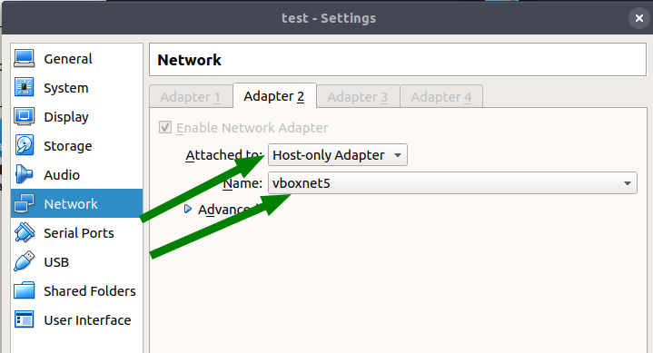

стенд поднят на centos7  и cobbler 2.8.5, для centos 8 готового пакета нет в связи с переходом на питон3 и собирать надо из исходников

требуется подложить в корневую директорию, рядом с Vagrantfile образ центос 7

    # wget https://mirror.yandex.ru/centos/7.7.1908/isos/x86_64/CentOS-7-x86_64-Minimal-1908.iso

при создании вручную кикстарт-файлов нужно пользоваться ksvalidator
    
    https://codingbee.net/centos/rhcsa-how-to-create-kickstart-files

при создании в виртуалбоксе виртуалки для тестирования работы pxe необходимо отключить интерфейс 1 (связано с особенностями работы вагранта), а также интерфейс 2 настроить на работу в той же сети, что интерфейс 2 pxe-сервера (см. ниже)

pxe-сервер доступен тут (_login cobbler, pass cobbler_):

    https://192.168.20.10/cobbler_web/
    

в продакшн случае нужно закрыть возможность обращаться в браузере куда-либо, кроме  cobbler_web, настроить selinux, 

можно настроить так, чтобы dhcp и dns рулились не на cobbler-хосте.

_/etc/dhcp/dhcpd.conf_ подкидывается, чтобы стартанул dhcp.service, далее он перезапишется при выполнении _cobbler sync_ из шаблона _/etc/cobbler/dhcp.template_

DHCP и DNS рулятся _/etc/cobbler/dhcp.template_ и _/etc/cobbler/dnsmasq.template_

